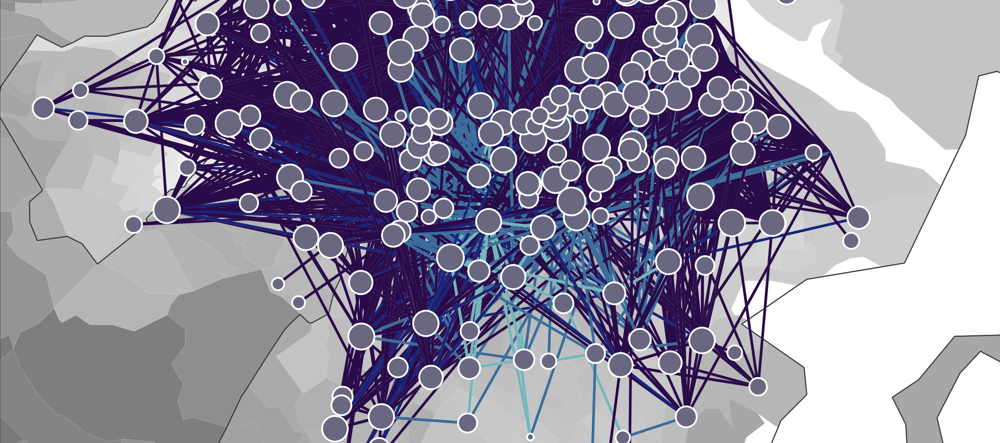

# bluebikes

- Repository for Study: _Cycling Cities: Measuring Urban Mobility Mixing in Bikeshare Networks_
- Authors: Timothy Fraser, Katherine Van Woert, Sophia Olivieri, Jonathan Baron, Katelyn Buckley, & Pamela Lalli
- Maintainer: Timothy Fraser, Systems Engineering Program, Cornell University <tmf77@cornell.edu>

## Welcome!

This site presents all materials for replicating our team's project analyzing the Boston BlueBikes network. All code is done in the R programming language.



## Navigating the Code

This repo is our repository for sharing all coding, data, and new techniques for our research project.

First steps:

- Unzip the `our_data/bluebikes.zip` file into `our_data/bluebikes.sqlite`!
- Install recommended packages from `packages.R`.

Then...
- To see our code for building the dataset, please see ```project_builder_code.Rmd```. 
- To see our code for analyzing the dataset, see `code_revision.R`.
- To review figures, see the `/viz folder`.
- For code to replicate the example illustration in our paper, see `illustration/figures.R`.
- Raw Bluebikes data files, re-encoded as R data storage (rds) files for compression, are available in `/processing/rides`. No identifiable data was used in this study; all data was accessed directly from the Bluebikes public data download system.

Notes:

- Early project code is stored in `guide.Rmd`/`guide.html`. Contrary to its name, please do not use this as reference material.
