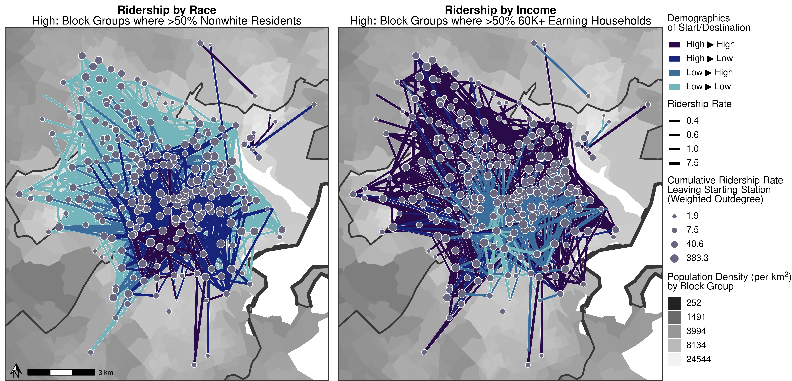

```{r setup, include=FALSE}
## Global options
knitr::opts_chunk$set(cache = TRUE)
```

# 0. Getting Started

Welcome! This site presents all materials for replicating our team's project analyzing the Boston BlueBikes network. 

First step: Unzip the `our_data/bluebikes.zip` file into `our_data/bluebikes.sqlite`.

```{r}
unzip("our_data/bluebikes.zip")

```

This RStudioCloud project is our repository for sharing all coding, data, and new techniques for our research project. To see our code for building the dataset, please see ```project_builder_code.Rmd``` in our RStudioCloud project. To see our code for analyzing the dataset, see below (also labelled ```guide.Rmd``` in the project)!

```{r, message = FALSE, warning = FALSE}
# First, let's load packages

# For data wrangling and spatial analysis
library(tidyverse)
library(sf)
library(tigris)
library(lubridate)

# For better visuals
library(viridis)
library(ggtext)
library(ggpubr)
library(shadowtext)
library(ggspatial)

# For parallel processing
library(furrr)
library(future)
```

# 1. BlueBikes Data

There's a lot of it! Here's a small sample of the data that you can use to explore.

Check out our data, 'test data', which contains bluebikes trips from December 2021. It's a HUGE file, so a good way to start would be by using ```sample_n()``` to take a random sample of it, rather than using the whole thing. Here's an example.

```{r, eval = FALSE, echo = FALSE}
read_rds("processing/rides/202112.rds")  %>%
#read_csv("raw_data/202112-bluebikes-tripdata.csv") %>%
  magrittr::set_colnames(value = names(.) %>% tolower() %>% str_replace_all(" ", "_")) %>%
  rename(
    from_x = start_station_longitude,
    from_y = start_station_latitude,
    to_x = end_station_longitude,
    to_y = end_station_latitude) %>%
  mutate(tripid = 1:n()) %>%
  write_rds("testdata.rds")
```

Total size of the file, for example.

```{r, message = FALSE, warning = FALSE}
read_rds("testdata.rds") %>%
  summarize(rows = n())
```

Here's how we take a random sample of 10,000 rides during 12/2021.

```{r, message=FALSE}
dat <- read_rds("testdata.rds") %>%
  sample_n(size = 10000)
```

Explore the data!

```{r, message = FALSE, warning = FALSE}
dat %>% head()
```

Try out using ```lubridate```, the tidyverse package that helps us work with date data.

```{r, message = FALSE, warning = FALSE}
library(lubridate)

dat %>%
  head() %>%
  select(starttime) %>%
  # We can use ceiling date to consolidate our dates...
  mutate(
    seconds = ceiling_date(starttime, unit = "seconds"),
    minutes = ceiling_date(starttime, unit = "minutes"),
    hours = ceiling_date(starttime, unit = "hours"),
    days = ceiling_date(starttime, unit = "days"),
    weeks = ceiling_date(starttime, unit = "weeks"),
    months = ceiling_date(starttime, unit = "months"))
```

This lets us analyze change over time.

```{r, message = FALSE, warning = FALSE}
result <- dat %>%
  # We can use ceiling date to consolidate our dates...
  mutate(days = ceiling_date(starttime, unit = "days")) %>%
  # Count trips per day
  group_by(days) %>%
  summarize(count = n())

result
```

And we can visualize them.

```{r, message = FALSE, warning = FALSE}
result %>%
  ggplot(mapping = aes(x = days, y = count)) +
  geom_col() +
  coord_flip()
```

Several other interesting traits are in this dataset, including station name and zipcode. Can you put together some descriptive statistics and visuals to examine how BlueBikes ridership varied over the last month? This will be a practice cycle for us as we get going.


```{r, eval = FALSE}
make_line = function(data){
  st_linestring(matrix(c(data$from_x, data$from_y, data$to_x, data$to_y), 2, 2)) %>%
    return()
}


library(sf)
test <- dat %>%
  pmap(make_line) %>%
  st_as_sf(crs = 4326)
  {tibble(id = df$id, geometry = .)} %>% 
  st_sf() 
```


# 2. Refined Data

Congrats! We've made it to the next statge of the project. Now that we have (1) reviewed the literature and (2) explored the raw data, we're going to analyze the (3) refined data. What does this mean?

We're going to use this SQLite database to access a refined version of our data. SQLite is really handy because we can ask it to do lots of number-crunching without loading all the millions of rows into our R environment, which would normally cause it to crash. Instead, we can feed SQLite basic dplyr functions, like ```select()```, ```mutate()```, ```filter()```, ```group_by()```, and ```summarize()```, and then ask the SQLite database to ```collect()``` the resulting data and give it to us in R. This output (should) be much, much, much smaller, at a size R can handle.

Our data is saved in ```our_data```. Please use this folder for all your data needs. I'd recommend not looking elsewhere, as it gets messy real fast :) Here's our data:

## {.tabset .tabset-pills}

### Datasets

- ```our_data/bluebikes.sqlite```: a HUGE compendium of datasets. These files are a little too big to access on their own, so we will access them via the SQLite database. Contains:

- ```tally_rush_edges``` (in ```bluebikes.sqlite```): a dataset tallying number of rides each day during morning and evening rushhour.

- ```tally_rush``` (in ```bluebikes.sqlite```): a dataset tallying number of rides each day during morning and evening rushhour, for EACH START AND END STATION. That's a LOT!

- ```our_data/stationbg_dataset.rds```: an ```sf``` dataset of geolocated points for all bluebike stations present in our data. Contains the ```geoid``` of the census block group each station is located in. Also contains all the traits of that block group!


Others You might run into, but don't need to think about as much.

- ```our_data/dates.rds```: a dataset of dates and days of the week for the past 10 years. Useful for filtering, but not strictly necessary.

- ```our_data/bgdataset.rds```: an ```sf``` dataset of all census block group polygons in Boston. Contains all the traits of each block group.


### Codebook

Here's a quick summary of all variable names you will run into.

- ```code```: unique ID for each bluebikes station.

- ```geoid```: unique ID for each census block group.

- ```count```: total rides occuring during that time, between those places.

Example Demographics Variable Set:

- ```pop_density_2020```: population density per square kilometer in 2020. Some places are missing data.

- ```pop_density_2020_smooth5```: population density, with missing data filled in by taking the median of their 5 nearest neighboring census block groups.

- ```pop_density_2020_smooth10```: population density, with missing data filled in by taking the median of their 10 nearest neighboring census block groups. Either is fine to use.

I generated many other variables too, saved in ```our_data/stationbg_dataset.rds.``` Let's look at them real quick.

```{r, message = FALSE, warning = FALSE}
read_rds("our_data/stationbg_dataset.rds") %>% 
  select(-contains("smooth")) %>%
  names()
```

Demographics

- ```pop_white_2020```: % of white residents (you can make pop_nonwhite_2020 by taking 1 - pop_white_2020)

- ```pop_black_2020```: % of Black residents

- ```pop_hisplat_2020```: % of Hispanic/Laitno residents

- ```pop_asian_2020```: % of Asian residents

- ```pop_natam_2020```: % of Native American residents


Socioeconomics

- ```pop_0_40000_2019```: % of families earning 0-40K a year.

- ```pop_40001_60000_2019```: % of families earning 40-60K a year.

- ```pop_60001_100000_2019```: % of families earning 60-100K a year.

- ```pop_100000_plus_2019```: % of families earning 100K+ a year.

- ```pop_some_college```: % of residents with some college education or more.

- ```pop_employed_2019```: % of residents employed, out of total population.


## Load Packages and Database

```{r, message = FALSE, warning = FALSE}
# Load Packages
library(tidyverse)
library(RSQLite)
library(DBI)

# Tell R to hire a 'SQL translator' object, which we'll name 'mydat',
# sourced from our bluebikes data
mydat <- dbConnect(RSQLite::SQLite(), "our_data/bluebikes.sqlite")

# Whenever you're finished, disconnect the SQL dataset, like so:
#dbDisconnect(mydat)
```

## Example Query

```{r, message = FALSE, warning = FALSE}
mydat %>%
  # Tell R to look in the tally_rush dataset in our SQLite database
  # It will return the first 1000 rows
  tbl("tally_rush") %>%
  # Grab first 6 rows
  head()
```

## Collecting Data

```{r, message = FALSE, warning = FALSE}
mine <- mydat %>%
  # Tell R to look in the tally_rush dataset in our SQLite database
  # It will return the first 1000 rows
  tbl("tally_rush") %>%
  # Grab first 6 rows
  head() %>%
  # extract those five rows to be used
  collect()

# Check it out!
mine
```

## Using ```str_sub()```

```str_sub()```, also known as string-sub, is an amazing function loaded within the ```tidyverse``` package. It allows you to extract part of your entry, based on the number of characters. It's great for extracting the year, month, day, census code, etc. out of structured text. Here's a quick example.

```{r, message = FALSE, warning = FALSE}
# Let's make an example dataset
mydates <- data.frame(day = c("2020-10-11", "2021-05-02", "2021-02-03"))

mydates
```

We can extract the first four letters by setting ```start = 1``` and ```end = 4```.
```{r, message = FALSE, warning = FALSE}
mydates$day %>% str_sub(start = 1, end = 4)
# Though you could also write it like this
# str_sub(mydates$day, start = 1, end = 4)
```
You could also write it like this, within ```mutate()```.

```{r, message = FALSE, warning = FALSE}
mydates %>%
  mutate(day = str_sub(day, start = 1, end = 4))
```
Finally, you could systematize a bunch of info in multiple columns!

```{r, message = FALSE, warning = FALSE}
mydates %>%
  mutate(
    # let's get the year
    y = str_sub(day, start = 1, end = 4),
    # then the month
    m = str_sub(day, start = 6, end = 7),
    # then the day!
    d = str_sub(day, start = 9, end = 10))
```
Handy, right?

<br>

## Summarizing Data

```{r, message = FALSE, warning = FALSE}
mydat %>%
  tbl("tally_rush") %>%
  # Zoom into October, using the 6th and 7th characters in the day vector
  filter(str_sub(day, start = 6, end = 7) == "10")  %>%
  # Zoom into just am rush hour traffic
  filter(rush == "am") %>%
  # Count how many rows (days) is in that?
  summarize(count = n()) %>%
  # collect response - 243 days!
  collect()
```

<br>

## Visualizing Collected Data!

```{r, message = FALSE, warning = FALSE}
myviz <- mydat %>%
  tbl("tally_rush") %>%
  # Zoom into October, using the 6th and 7th characters in the day vector
  filter(str_sub(day, start = 6, end = 7) == "10")  %>%
  # Zoom into just am rush hour traffic
  filter(rush == "am") %>%
  # collect response - 243 days!
  collect() %>%
  # If you ever work with date data, 
  # you WILL have to transform it from character into date format
  mutate(day = as.POSIXct(day))

myviz %>% 
  ggplot(mapping = aes(x = day, y = count)) +
  geom_jitter(size = 3, color = "purple", alpha = 0.5) +
  labs(subtitle = "Yay October!")
```

# 3. Network Data

The big one we need to worry about file size with is ```tally_rush_edges`. It's also the coolest!

```{r, message = FALSE, warning = FALSE}
myedges <- mydat %>%
  tbl("tally_rush_edges") %>%
  # zoom into just 2021
  filter(str_sub(day, 1,4) == "2021") %>%
  # zoom into just morning
  filter(rush == "am") %>%
  # It's just 20000 rows, so let's collect it. I'd avoid going above 50K.
  collect() %>%
  as_tibble()

# How many rows?
myedges %>%
  summarize(count = n())
```

```{r, message = FALSE, warning = FALSE}
# Wow! That's a lot of data! Let's look at just a few rows.
myedges %>% head()
```

So, in ```start_code```, we've got the unique identifier for each bluebikes station that a person checked a bike out from. ```end_code``` shows the station they returned the bike to afterwards. ```day``` shows that date it all occurred during. ```rush``` indicates whether it happened during rush hour in the ```"am"``` or ```"pm"```. And count is the number of rides (roughly = people).


```{r, message = FALSE, warning = FALSE}
mystations <- read_rds("our_data/stationbg_dataset.rds") %>%
  # Let's get the block group population of African Americans where each station is,
  # using our spatially smoothed estimate, 'pop_black_2020_smooth5'
  select(code, pop_black_2020_smooth5) %>%
  # And let's classify it as 
  # above 50% or below 50%
  mutate(maj_black = if_else(pop_black_2020_smooth5 > 0.5, "yes", "no")) %>%
  # convert to tibble, 
  as_tibble() %>%
  select(code, maj_black)

mystations %>% head()
```

## Mobility Patterns

Finally, let's join in our demographic traits to get a glimpse of what this mobility network looks like in terms of which neighborhoods are getting connected - eg. *who* rides? We will classify each station based on its block group's traits!

```{r, message = FALSE, warning = FALSE}
mydemo <- myedges %>%
  # We can join in the source traits,
  # Eg. whether the station is in a majority Black neighborhood
  left_join(by = c("start_code" = "code"), 
            y = mystations %>% select(code, start_black = maj_black)) %>% 
  # We can join in the destination traits,
  # Eg. whether that station is in a majority Black neighborhood
  left_join(by = c("end_code" = "code"), 
            y = mystations %>% select(code, end_black = maj_black)) 

# Handy side benefit: if start_black or end_black == NA, that means the start_code station or end_code station are not in boston proper (eg. maybe in Cambridge or beyond.) 
# I'd like to zoom into Boston, for the time being.
mydemo %>% head()
```

You can repeat this process with *any* of the demographic variables in ```stationbg_dataset.rds``` (as long as it makes sense. Rule of thumb: simple analyses are usually better and closer to the truth).

## Analyzing Frequency

How often do people bike between predominantly Black neighborhoods? Let's find out, using ```group_by()``` and ```summarize()```. Let's add up the total trips (stored in ```count```) for each subgroup.

```{r, message = FALSE, warning = FALSE}
mydemo %>%
  group_by(start_black, end_black) %>%
  summarize(trips = sum(count, na.rm = TRUE))
```

This is very cool, but we should probably deal with those NAs. The NAs refer to stations outside of Boston - to keep this manageable, we're just looking at movement within Boston. We can ```filter()``` out ```"NA"``` observations like this:

```{r, message = FALSE, warning = FALSE}
mydemo %>%
  # Remove rows where start_black == NA or end_black == NA
  filter(start_black != "NA" & end_black != "NA") %>%
  group_by(start_black, end_black) %>%
  summarize(trips = sum(count, na.rm = TRUE))
```


```{r, message = FALSE, warning = FALSE}
mytab <- mydemo %>%
  # Remove rows where start_black == NA or end_black == NA
  filter(start_black != "NA" & end_black != "NA") %>%
  group_by(start_black, end_black) %>%
  summarize(trips = sum(count, na.rm = TRUE)) %>%
  ungroup() %>%
  mutate(total = sum(trips),
         percent = trips / total) %>%
  # Clean up the percentages
  mutate(percent = round(percent*100, digits = 1))

# view it!
mytab
```

So that's... disquieting. Yikes. I mean, it's an individual choice to ride or not, but when a public program sees low rates of participation from neighborhoods of color as small as that, it's not really an equitable policy outcome.


## Visualize it!

### Bar Charts!

It's bar-chart time! So many bar charts!

```{r, message = FALSE, warning = FALSE}
mytab %>%
  ggplot(mapping = aes(x = start_black, y = trips, fill = end_black)) +
  geom_col(position = "fill") +
  labs(subtitle = "What % of Rides that started out in Black Neighborhoods\nended in Black Neighborhoods?",
       y = "% of Rides",
       x = "Starting Station\nin Majority Black Neighborhood?",
       fill = "Ending Station\nin Majority\nBlack\nNeighborhood?")
```


### Filtered Bar Charts!

Sometimes filtered bar charts are more intuitive to read.

```{r, message = FALSE, warning = FALSE}
mytab %>%
  mutate(type = paste(start_black, "->", end_black)) %>%
  ggplot(mapping = aes(x = type, y = percent)) +
  geom_col() +
  geom_text(mapping = aes(label = percent), vjust = 0, nudge_y = 2) +
  labs(subtitle = "What % of Rides that started out in Black Neighborhoods\nended in Black Neighborhoods?",
       y = "% of Rides",
       x = "Starting Neighborhood >50% Black? -> Ending Station >50% Black?")
```


### Heat Maps!

Another great option is ```geom_tile()```, also known as heatmaps.

```{r, message = FALSE, warning = FALSE}
library(viridis)
mytab %>%
  select(start_black, end_black, percent) %>%
  ggplot(mapping = aes(x = start_black, y = end_black, fill = percent, label = percent)) +
  geom_tile(color = "white") +
  geom_text(size = 8) +
  # Viridis is back!!!
  scale_fill_viridis(option = 'mako', begin = 0.2, end = 0.8) +
  theme_classic(base_size = 14) +
  labs(x = "Starting Station\nin Majority Black Neighborhood?", 
       y = 'Ending Station\nin Majority Black Neighborhood?',
       subtitle = "% of BlueBikes Ridership between Black/White Neighborhoods")
```

# 4. Networks over Time

Oh hang on, didn't we have this data for every place over time?

```{r, eval = FALSE}
# Load Packages
library(tidyverse)
library(RSQLite)
library(DBI)

# Tell R to hire a 'SQL translator' object, which we'll name 'mydat',
# sourced from our bluebikes data
mydat <- dbConnect(RSQLite::SQLite(), "our_data/bluebikes.sqlite")

mytime <- mydat %>%
  tbl("tally_rush_edges") %>%
  # zoom into just morning
  filter(rush == "am") %>%
  # drop unnecessary variables, to keep this dataset as small as possible
  select(-rush) %>%
  collect()
```

```{r, echo = FALSE, message=FALSE, warning = FALSE}
#mytime %>% saveRDS("processing/mytime.rds")
mytime <- read_rds("processing/mytime.rds")
```

```{r, message = FALSE, warning = FALSE}
# WOW! that's a huge dataset. We hit 2 million rows!!!
# This is all the station-pairs from 2011 to 2021.
mytime %>% head()  
```


Okay, this is going to be rough, but here we go!

We're going to join in demographics, filter to valid cases, and get our percentages for every year.

```{r, message = FALSE, warning = FALSE}
mytimedemo <- mytime %>%
  left_join(by = c("start_code" = "code"), 
            y = mystations %>% 
              select(code, start_black = maj_black)) %>% 
  # We can join in the destination traits,
  # Eg. whether that station is in a majority Black neighborhood
  left_join(by = c("end_code" = "code"), 
            y = mystations %>% 
              select(code, end_black = maj_black))  %>%
  # We can join in the source traits,
  # Remove rows where start_black == NA or end_black == NA
  filter(start_black != "NA" & end_black != "NA") %>%
  # Now count up by YEAR
  group_by(year = str_sub(day, 1, 4),
           # and by start and end type
           start_black, end_black) %>%
  summarize(trips = sum(count, na.rm = TRUE)) %>%
  ungroup() %>%
  # Now for each year, calculate percentage
  group_by(year) %>%
  mutate(total = sum(trips),
         percent = trips / total) %>%
  # Clean up the percentages
  mutate(percent = round(percent*100, digits = 1))


# and let's quickly get rid of that 2 million row dataset so our computer can breath easy.
remove(mytime)
```

Check it out!!!!


```{r, message = FALSE, warning = FALSE}
mytimedemo
```

Let's finish up by visualizing some equity questions over time!

```{r, message = FALSE, warning = FALSE}
mytimedemo %>%
  # Zoom into just majority non-black-non-black pairs
  filter(start_black == "no", end_black == "no") %>%
  ggplot(mapping = aes(x = year, y = percent, group = 1)) +
  geom_point(size = 5) +
  geom_line() +
  theme_classic(base_size = 14) +
  labs(y = "% Trips between Majority Non-Black Neighborhoods,\nout of Total Trips",
       x = "Year",
       subtitle = "Very tiny changes in Demographic Mobility\nin BlueBikes Program over Time")
```

### Milestone:

Using these basic tools, we constructed a series of preliminary evaluations to explore the demographic and socioeconomic breakdown of Bluebikes ridership, with a focus on equity. Is the program reaching a broad slice of the population? Or not so much? When and where is it succeeding vs. struggling?

Using a chosen demographic variable, each team member set an expectation/hypothesis, and then tested it - Eg. I expect things to look pretty even, or I expect things to look pretty uneven!

Finally, we compiled results and refined analyses.


# 5. Permutation Tests

This study calculated a series of network statistics, all of them being proportions representing how homophilous the bluebikes user movement patterns were.

We measured homophily by race, income, education, and population density.

Some amount of homophily, however, was guaranteed, based on the structure of the network. For example, a city with more BlueBikes stations in white neighborhoods may *by default* see more homophilous mobility. So, we want to estimate how much mobility occurs *by default* between neighborhoods of the same type, subtract that out, and see if the differences between groups remain considerably large.

We'll control by design by zooming just into rush hour time periods. In fact, it makes sense to just zoom into AM or PM traffic, so that we're capturing just one direction of movement.

We also need to adjust for time, by calculating each statistic year-by-year, since the total number of riders and places available changed dramatically from year to year, so we want the denominator to differ each year. We want to only permute movement among stations which were actually available/in use each year. Since the numbers on when each site was opened were a little fuzzy - I'd like to use a data-driven approach to estimate this. Eg. only permute edges among the stations where at least 1 (or maybe 10 or 100) users actually moved during a year. This is a control for whether the stations were in use.

```{r, message = FALSE, warning = FALSE}
# Load Packages
library(tidyverse)
library(RSQLite)
library(DBI)

# Tell R to hire a 'SQL translator' object, which we'll name 'mydat',
# sourced from our bluebikes data
mydat <- dbConnect(RSQLite::SQLite(), "our_data/bluebikes.sqlite")

mydat %>%
  tbl("tally_rush_edges") %>%
  # zoom into just morning
  filter(rush == "am") %>%
  # drop unnecessary variables, to keep this dataset as small as possible
  select(-rush) %>%
  collect() %>%
  saveRDS("processing/mytime.rds")
```

## Get Node and Edgelist

```{r, message = FALSE, warning = FALSE}
library(tidyverse)
library(sf)
library(tidygraph)

read_rds("our_data/stationbg_dataset.rds") %>%
  # Build a threshold by pop density tericles
  mutate(density = ntile(pop_density_2020_smooth10, 2)) %>%
  # Create terciles by age
  mutate(age = ntile(pop_over_65_2019_smooth10, 2)) %>%
  # Create terciles by education
  mutate(edu = ntile(pop_some_college_smooth10, 2)) %>%
  # Calculate total (smoothed) share of residents making UNDER the US median household income
  mutate(pop_lower_income = pop_0_40000_2019_smooth10 + pop_40001_60000_2019_smooth10) %>%
  # Now build a threshold describing income 
  mutate(income = ntile(pop_lower_income, 2)) %>%
  # Calculate total (smoothed) nonwhite population per block group
  mutate(pop_nonwhite = 1 - pop_white_2020_smooth10) %>%
  # Create quartiles by race
  mutate(nonwhite = ntile(pop_nonwhite, 2)) %>%
  bind_cols(st_coordinates(.$geometry) %>% as_tibble() %>% select(x = 1, y = 2)) %>%
  # convert to tibble, 
  as_tibble() %>%
  
  # Create our homophily variables for testing
  mutate(
    # Reverse code income, so that Low = More lower income families and High = more upper income families
    bin_income = if_else(pop_lower_income > 0.50, true = "low", false = "high"),
    bin_nonwhite = if_else(pop_nonwhite > 0.50, true =  "high", false = "low"),
    bin_edu = if_else(pop_some_college_smooth10 > median(pop_some_college_smooth10, na.rm = TRUE),
                      true = "high", false = "low"),
    bin_dense = if_else(pop_density_2020_smooth10 > median(pop_density_2020_smooth10, na.rm = TRUE),
                        true = "high", false = "low")) %>%
  # Save
  write_rds("our_data/nodes.rds")

mystations <- read_rds("our_data/nodes.rds")

read_rds("processing/mytime.rds") %>%
  # Filter to valid stations
  filter(start_code %in% mystations$code &
         end_code %in% mystations$code) %>%
  #filter(!is.na(start_code) & !is.na(end_code)) %>%
  group_by(start_code, end_code, year = str_sub(day, 1,4)) %>%
  summarize(weight = sum(count, na.rm = TRUE)) %>%
  ungroup() %>%
  # THRESHOLD BY USAGE
  # Design-based control for low usage levels
  # Threshold: filter to just pairs where at least 100 bluebikes trips occurred ridden in an entire year
  filter(weight >= 100) %>%
  # BLOCK BY USAGE
  # classify edgeweights into quintiles
  mutate(traffic = ntile(weight, 5)) %>%
  # BLOCK BY DISTANCE
  left_join(by = c("start_code" = "code"), y = mystations %>% select(code, x1 = x, y1 = y)) %>%
  left_join(by = c("end_code" = "code"), y = mystations %>% select(code, x2 = x, y2 = y)) %>%
  mutate(geometry = sprintf("LINESTRING(%s %s, %s %s)", x1, y1, x2, y2)) %>%
  st_as_sf(wkt = "geometry", crs = 4326) %>%
  select(-x1, -x2, -y1, -y2) %>%
  mutate(dist = as.numeric(st_length(geometry)) / 1000) %>%
  mutate(distcat = ntile(dist, 5)) %>%
  as_tibble() %>%
  # Join in income terciles
  left_join(by = c("start_code" = "code"), y = mystations %>% 
              select(code, 
                     start_density = density, start_edu = edu, start_age = age,
                     start_income = income, start_nonwhite = nonwhite,
                     start_pop_density = pop_density_2020_smooth10)) %>%
  left_join(by = c("end_code" = "code"), y = mystations %>% 
              select(code, end_density = density, end_edu = edu, end_age = age,
                     end_income = income, end_nonwhite = nonwhite,
                     end_pop_density = pop_density_2020_smooth10)) %>%
  # Let's also create a population density normalizing weight for our edges,
  # representing the product between the start and end population density.
  # Also, divide by 1000, because the numbers get really big otherwise
  mutate(weight_pop_density = start_pop_density/1000 * end_pop_density/1000) %>%
  write_rds("our_data/edges_annual.rds")
```

## Thresholding

### Edge Weight

Here's our justification for block permuting by edge weight deciles. There's a second dimension here. Really, we don't want to allow edge weights to switch between very different pairs; eg. an edge of 500 from Downtown Crossing to Back Bay should not get switched with 3 from JP to Forest Hills. However, there are so many different numbers of people who traveled that we need to create a few categories indicating which edges get exchanged. We'll call this variable **volume**, and it's just a categorical variable describing their location on the edge weight distribution.

```{r, message = FALSE, warning = FALSE}
myedges <- read_rds("our_data/edges_annual.rds")

myrange <- myedges %>%
  as_tibble() %>%
  group_by(traffic) %>%
  summarize(
    count = n(),
    min = min(weight, na.rm = TRUE),
    max = max(weight, na.rm = TRUE))

myedges %>%
  as_tibble() %>% 
  ggplot(mapping = aes(x = weight)) +
  geom_rect(data = myrange, mapping = aes(x = NULL, xmin = min, xmax = max, ymin = 0, ymax = Inf, fill = traffic), color = "#373737") +
  geom_histogram(mapping = aes(y = ..density..), color = "white", fill = "#373737", bins = 50)  +
  geom_density(color = "white", size=  3) +
  geom_density(color = "blue", size = 1) +
  scale_x_log10(breaks = c(100, 300, 1000, 3000, 10000)) +
  labs(y = "Frequency of Rides by Station Pairs\nDensity Distribution of Edge-Weights",
       x = "# of Rides per Year per Station-Pair\n(Edge-Weights for Station-Pair-Year Observations)") +
  theme_classic(base_size = 14) +
  theme(legend.position = "bottom",
        legend.margin = margin(0,0,0,0, "cm")) +
  scale_fill_gradient(low = "white", high = "#648FFF",
                      breaks = 0:10, name = "Quintiles by Rides") +
  guides(fill = guide_colorbar(barwidth = 20, barheight = 1))
```

### Distance

```{r, message = FALSE, warning = FALSE}
myrange <- myedges %>%
  as_tibble() %>%
  mutate(distcat = ntile(dist, 5)) %>%
  group_by(distcat) %>%
  summarize(
    count = n(),
    min = min(dist, na.rm = TRUE),
    max = max(dist, na.rm = TRUE))

myedges %>%
  as_tibble() %>% 
  ggplot(mapping = aes(x = dist)) +
  geom_rect(data = myrange, mapping = aes(x = NULL, xmin = min, xmax = max, ymin = 0, ymax = Inf, fill = distcat), color = "#373737") +
  geom_histogram(mapping = aes(y = ..density..), color = "white", fill = "#373737", bins = 50)  +
  geom_density(color = "white", size=  3) +
  geom_density(color = "blue", size = 1) +
  scale_x_log10(breaks = c(0.1, .3, 1, 3, 10, 30, 100)) +
  labs(y = "Frequency of Distances\nby Station Pairs",
       x = "Distance Travelled per Year per Station-Pair\n(Distances (km) for Station-Pair-Year Observations)") +
  theme_classic(base_size = 14) +
  theme(legend.position = "bottom",
        legend.margin = margin(0,0,0,0, "cm")) +
  scale_fill_gradient(low = "white", high = "#648FFF",
                      breaks = 0:10, name = "Quintiles by Distance") +
  guides(fill = guide_colorbar(barwidth = 20, barheight = 1))
```

### Pop density

```{r, message = FALSE, warning = FALSE}
# We identified the median
# Are households above or below the US median household income?
mystations %>%
  # Calculate total (smoothed) share of residents making UNDER the US median household income
  group_by(density = ntile(pop_density_2020_smooth10, 3)) %>%
  summarize(n = n(),
            min = min(pop_density_2020_smooth10, na.rm = TRUE),
            max = max(pop_density_2020_smooth10, na.rm = TRUE))
```

### Race

```{r, message = FALSE, warning = FALSE}
# We identified the median
# Are households above or below the US median household income?
mystations %>%
  # Calculate total (smoothed) nonwhite population per block group
  mutate(pop_nonwhite = 1 - pop_white_2020_smooth10) %>%
  group_by(nonwhite = case_when(
    pop_nonwhite > 0 & pop_nonwhite < 0.25 ~ "mostly_white",
    pop_nonwhite >= 0.25 & pop_nonwhite < 0.50 ~ "somewhat_white",
    pop_nonwhite >= 0.50 & pop_nonwhite < 0.75 ~ "somewhat_nonwhite",
    pop_nonwhite >= 0.75 & pop_nonwhite < 1.00 ~ "mostly_nonwhite",
    TRUE ~ NA_character_)) %>%
  count()
```

### Income

```{r, message = FALSE, warning = FALSE}
mystations %>%
  # Calculate total (smoothed) share of residents making UNDER the US median household income
  mutate(pop_lower_income = pop_0_40000_2019_smooth10 + pop_40001_60000_2019_smooth10) %>%
  select(code, pop_lower_income) %>%
  group_by(income = case_when(
    pop_lower_income < 0.20 ~ "highest_income",
    pop_lower_income >= 0.20 & pop_lower_income < 0.40 ~ "higher_income",
    pop_lower_income >= 0.40 & pop_lower_income < 0.60 ~ "lower_income",
    pop_lower_income >= 0.60 & pop_lower_income < 0.80 ~ "lowest_income",
    TRUE ~ NA_character_)) %>%
  count()
```

### Education

```{r, message = FALSE, warning = FALSE}
mystations %>%
  group_by(edu = ntile(pop_some_college_smooth10, 3)) %>%
  summarize(count = n(),
            min = min(pop_some_college_smooth10, na.rm = TRUE),
            max = max(pop_some_college_smooth10, na.rm = TRUE))
```

### Age

```{r, message = FALSE, warning = FALSE}
# We identified the median
# Are households above or below the US median household income?
mystations %>%
  group_by(age = ntile(pop_over_65_2019_smooth10, 3)) %>%
  summarize(count = n(),
            min = min(pop_over_65_2019_smooth10, na.rm = TRUE),
            max = max(pop_over_65_2019_smooth10, na.rm = TRUE))
```


## Check Strata / Blocks

```{r, message = FALSE, warning = FALSE}
rm(list = ls())
net <- read_rds("our_data/edges_annual.rds")

net %>%
  group_by(year, 
           traffic, distcat,
           start_density, end_density,
           #start_age, end_age,
           start_edu, end_edu,
           start_income, end_income,
           start_nonwhite, end_nonwhite) %>%
  count() %>%
  ungroup() %>%
  count()
# 7998 blocks

```

## Practice Permutation

```{r, message = FALSE, warning = FALSE}
ex <- data.frame(
  weight = c(100, 200, 300, 200, 
             500, 300, 200, 100) %>% as.numeric(),
  block = c("a", "b", "b", "b",
             "c", "c", "c", "b")) 


get_sample = function(x){
  if(length(x) == 1){
    return(x)
  }else{
    sample(x, size = length(x), replace = FALSE) %>%
      return()}
}

ex %>%
  split(.$block) %>%
  map(~get_sample(.$weight))


ex %>%
  group_by(block) %>%
  summarize(perm = get_sample(weight) %>% unlist())
```


## Run Permutations

### Data Prep

```{r, message = FALSE, warning = FALSE}
rm(.Random.seed, envir=globalenv())
library(tidyverse)
library(sf)
library(tidygraph)


read_rds("our_data/edges_annual.rds") %>%
  # Join in key traits of interest
  left_join(by = c("start_code" = "code"), y = read_rds("our_data/nodes.rds") %>% 
              select(code, start_bin_income = bin_income, 
                     start_bin_nonwhite = bin_nonwhite, 
                     start_bin_edu = bin_edu, start_bin_dense = bin_dense)) %>%
  left_join(by = c("end_code" = "code"), y = read_rds("our_data/nodes.rds") %>% 
              select(code, end_bin_income = bin_income, 
                     end_bin_nonwhite = bin_nonwhite, 
                     end_bin_edu = bin_edu, end_bin_dense = bin_dense)) %>%
  mutate(bin_nonwhite = paste(start_bin_nonwhite, end_bin_nonwhite, sep = "-"),
         bin_income = paste(start_bin_income, end_bin_income, sep = "-"),
         bin_edu = paste(start_bin_edu, end_bin_edu, sep = "-"),
         bin_dense = paste(start_bin_dense, end_bin_dense, sep = "-")) %>%
  write_rds("our_data/edges_annual_prepped.rds")

```

### Functions

```{r, message = FALSE, warning = FALSE}

# Repeat our sampling function
get_sample = function(x){
  if(length(x) == 1){
    return(x)
  }else{
    sample(x, size = length(x), replace = FALSE) %>%
      return()}
}

# Let's write a quick wrapper function to permute the data
get_perm = function(nreps){
  print(nreps)
  
  net %>%
    group_by(block) %>%
    mutate(perm = get_sample(weight) %>% unlist()) %>%
    ungroup() %>%
    return()
}

# Let's write a second function to calculate summary statistics from the data
get_stat = function(data){
  data %>%
    # Normalize by the product of source * destination pop density per km2
    mutate(perm = perm / weight_pop_density) %>%
    # Get homophily by year (since we can just aggregate the final stats later)
    group_by(year) %>%
    summarize(
      # Race
      nonwhite_ll = sum(perm[bin_nonwhite == "low-low"], na.rm = TRUE),
      nonwhite_lh = sum(perm[bin_nonwhite == "low-high"], na.rm = TRUE),
      nonwhite_hl = sum(perm[bin_nonwhite == "high-low"], na.rm = TRUE),
      nonwhite_hh = sum(perm[bin_nonwhite == "high-high"], na.rm = TRUE),
      # Income
      income_ll = sum(perm[bin_income == "low-low"], na.rm = TRUE),
      income_lh = sum(perm[bin_income == "low-high"], na.rm = TRUE),
      income_hl = sum(perm[bin_income == "high-low"], na.rm = TRUE),
      income_hh = sum(perm[bin_income == "high-high"], na.rm = TRUE),
      # Education
      edu_ll = sum(perm[bin_edu == "low-low"], na.rm = TRUE),
      edu_lh = sum(perm[bin_edu == "low-high"], na.rm = TRUE),
      edu_hl = sum(perm[bin_edu == "high-low"], na.rm = TRUE),
      edu_hh = sum(perm[bin_edu == "high-high"], na.rm = TRUE),
      # Dense
      dense_ll = sum(perm[bin_dense == "low-low"], na.rm = TRUE),
      dense_lh = sum(perm[bin_dense == "low-high"], na.rm = TRUE),
      dense_hl = sum(perm[bin_dense == "high-low"], na.rm = TRUE),
      dense_hh = sum(perm[bin_dense == "high-high"], na.rm = TRUE)) %>%
    return()
}

save(get_sample, get_perm, get_stat, file = "our_data/functions.RData")
```

### Observed

```{r, message = FALSE, warning = FALSE}
load("our_data/functions.RData")

# Compare against observed
read_rds("our_data/edges_annual_prepped.rds") %>%
  # Quickly rename observed weight to 'perm', so we can reuse function
  rename(perm = weight) %>%
  # But rest assured, we are indeed calculating the observed statistics, not permuted
  get_stat() %>%
  # Combine all 4 categories of any of the varibales
  mutate(total = nonwhite_ll + nonwhite_lh + nonwhite_hl + nonwhite_hh) %>%
  write_rds("our_data/obs.rds")

rm(list= ls())
```

#### Descriptives

```{r, message = FALSE, warning = FALSE}
# Compare against observed
net <- read_rds("our_data/edges_annual_prepped.rds")

# Unique stations
c(net$start_code,
  net$end_code) %>% unique() %>% length()


net$year %>% unique() %>% length()

net %>%
  select(start_code, end_code) %>%
  distinct() %>%
  dim()

net$weight %>% sum()


# Compare against original network
mystations <- read_rds("our_data/nodes.rds")

first <- read_rds("processing/mytime.rds") %>%
  # Filter to valid stations
  filter(start_code %in% mystations$code &
         end_code %in% mystations$code) %>%
  #filter(!is.na(start_code) & !is.na(end_code)) %>%
  group_by(start_code, end_code, year = str_sub(day, 1,4)) %>%
  summarize(weight = sum(count, na.rm = TRUE)) %>%
  ungroup()

c(first$start_code, first$end_code) %>% unique() %>% length()

first$weight %>% sum()

first %>%
  select(start_code, end_code) %>%
  distinct() %>%
  dim()

remove(net, mystations, first)
```

### Controlling for Year

```{r, message = FALSE, warning = FALSE, eval = FALSE}
load("our_data/functions.RData")

net <- read_rds("our_data/edges_annual_prepped.rds") %>%
  mutate(block = paste(year, 
                       #traffic, distcat,
                       #start_density, end_density,
                       #start_age, end_age,
                       #start_edu, end_edu,
                       #start_income, end_income,
                       #start_nonwhite, end_nonwhite, 
                       sep = "-") %>% factor() %>% as.numeric())  %>%
  select(start_code, end_code, year, block, weight, 
         bin_nonwhite, bin_income, bin_edu, bin_dense, weight_pop_density)  %>%
  ungroup()

1:1000 %>%
  map_dfr(~get_perm(.) %>% get_stat(), .id = "replicate") %>%
  mutate(total = nonwhite_ll + nonwhite_lh + nonwhite_hl + nonwhite_hh)  %>%
  write_rds("our_data/perms_1.rds")


rm(list= ls())
```


### Controlling for Year + Traffic Level

```{r, message = FALSE, warning = FALSE, eval = FALSE}
load("our_data/functions.RData")

net <- read_rds("our_data/edges_annual_prepped.rds") %>%
  mutate(block = paste(year, traffic, 
                       #distcat,
                       #start_density, end_density,
                       #start_age, end_age,
                       #start_edu, end_edu,
                       #start_income, end_income,
                       #start_nonwhite, end_nonwhite, 
                       sep = "-") %>% factor() %>% as.numeric())  %>%
  select(start_code, end_code, year, block, weight, 
         bin_nonwhite, bin_income, bin_edu, bin_dense, weight_pop_density)  %>%
  ungroup()

1:1000 %>%
  map_dfr(~get_perm(.) %>% get_stat(), .id = "replicate") %>%
  mutate(total = nonwhite_ll + nonwhite_lh + nonwhite_hl + nonwhite_hh)  %>%
  write_rds("our_data/perms_2.rds")


rm(list= ls())
```

### Controlling for Year + Traffic Level + Distance

```{r, message = FALSE, warning = FALSE, eval = FALSE}
load("our_data/functions.RData")

net <- read_rds("our_data/edges_annual_prepped.rds") %>%
  mutate(block = paste(year, traffic, 
                       distcat,
                       #start_density, end_density,
                       #start_age, end_age,
                       #start_edu, end_edu,
                       #start_income, end_income,
                       #start_nonwhite, end_nonwhite, 
                       sep = "-") %>% factor() %>% as.numeric())  %>%
  select(start_code, end_code, year, block, weight, 
         bin_nonwhite, bin_income, bin_edu, bin_dense, weight_pop_density)  %>%
  ungroup()

1:1000 %>%
  map_dfr(~get_perm(.) %>% get_stat(), .id = "replicate") %>%
  mutate(total = nonwhite_ll + nonwhite_lh + nonwhite_hl + nonwhite_hh)  %>%
  write_rds("our_data/perms_3.rds")


rm(list= ls())
```

### Controlling for Year + Traffic Level + Distance + Density

```{r, message = FALSE, warning = FALSE, eval = FALSE}
load("our_data/functions.RData")

net <- read_rds("our_data/edges_annual_prepped.rds") %>%
  mutate(block = paste(year, traffic, 
                       distcat,
                       start_density, end_density,
                       sep = "-") %>% factor() %>% as.numeric())  %>%
  select(start_code, end_code, year, block, weight, 
         bin_nonwhite, bin_income, bin_edu, bin_age, bin_dense, weight_pop_density)  %>%
  ungroup()

1:1000 %>%
  map_dfr(~get_perm(.) %>% get_stat(), .id = "replicate") %>%
  mutate(total = nonwhite_ll + nonwhite_lh + nonwhite_hl + nonwhite_hh)  %>%
  write_rds("our_data/perms_4.rds")


rm(list= ls())
```

### Controlling for Year + Traffic Level + Distance + Density + Edu

```{r, message = FALSE, warning = FALSE, eval = FALSE}
load("our_data/functions.RData")

net <- read_rds("our_data/edges_annual_prepped.rds") %>%
  mutate(block = paste(year, traffic, 
                       distcat,
                       start_density, end_density,
                       start_edu, end_edu,
                       sep = "-") %>% factor() %>% as.numeric())  %>%
  select(start_code, end_code, year, block, weight, 
         bin_nonwhite, bin_income, bin_edu, bin_dense, weight_pop_density)  %>%
  ungroup()

1:1000 %>%
  map_dfr(~get_perm(.) %>% get_stat(), .id = "replicate") %>%
  mutate(total = nonwhite_ll + nonwhite_lh + nonwhite_hl + nonwhite_hh)  %>%
  write_rds("our_data/perms_5.rds")


rm(list= ls())
```

### Controlling for Year + Traffic Level + Distance + Density + Edu + Age

```{r, message = FALSE, warning = FALSE, eval = FALSE}
load("our_data/functions.RData")

net <- read_rds("our_data/edges_annual_prepped.rds") %>%
  mutate(block = paste(year, traffic, 
                       distcat,
                       start_density, end_density,
                       start_edu, end_edu,
                       start_age, end_age,
                       #start_nonwhite, end_nonwhite, 
                       #start_income, end_income,
                       sep = "-") %>% factor() %>% as.numeric())  %>%
  select(start_code, end_code, year, block, weight, 
         bin_nonwhite, bin_income, bin_edu, bin_dense, weight_pop_density)  %>%
  ungroup()

1:1000 %>%
  map_dfr(~get_perm(.) %>% get_stat(), .id = "replicate") %>%
  mutate(total = nonwhite_ll + nonwhite_lh + nonwhite_hl + nonwhite_hh)  %>%
  write_rds("our_data/perms_6.rds")


rm(list= ls())
```

### Controlling for Year + Traffic Level + Distance + Density + Edu + Age + Income

```{r, message = FALSE, warning = FALSE, eval = FALSE}
load("our_data/functions.RData")

net <- read_rds("our_data/edges_annual_prepped.rds") %>%
  mutate(block = paste(year, traffic, 
                       distcat,
                       start_density, end_density,
                       start_edu, end_edu,
                       start_age, end_age,
                       start_income, end_income,
                       #start_nonwhite, end_nonwhite, 
                       sep = "-") %>% factor() %>% as.numeric())  %>%
  select(start_code, end_code, year, block, weight, 
         bin_nonwhite, bin_income, bin_edu, bin_dense, weight_pop_density)  %>%
  ungroup()

1:1000 %>%
  map_dfr(~get_perm(.) %>% get_stat(), .id = "replicate") %>%
  mutate(total = nonwhite_ll + nonwhite_lh + nonwhite_hl + nonwhite_hh)  %>%
  write_rds("our_data/perms_7.rds")

rm(list= ls())
```


### Controlling for Year + Traffic Level + Distance + Density + Edu + Age+ Income + Race 

```{r, message = FALSE, warning = FALSE, eval = FALSE}
load("our_data/functions.RData")

net <- read_rds("our_data/edges_annual_prepped.rds") %>%
  mutate(block = paste(year, traffic, 
                       distcat,
                       start_density, end_density,
                       start_edu, end_edu,
                       start_age, end_age,
                       start_income, end_income,
                       start_nonwhite, end_nonwhite, 
                       sep = "-") %>% factor() %>% as.numeric())  %>%
  select(start_code, end_code, year, block, weight, 
         bin_nonwhite, bin_income, bin_edu, bin_dense, weight_pop_density)  %>%
  ungroup()

1:1000 %>%
  map_dfr(~get_perm(.) %>% get_stat(), .id = "replicate") %>%
  mutate(total = nonwhite_ll + nonwhite_lh + nonwhite_hl + nonwhite_hh)  %>%
  write_rds("our_data/perms_8.rds")


rm(list= ls())
```


## Compare

```{r, message = FALSE, warning = FALSE}
myperms <- bind_rows(
  read_rds("our_data/perms_1.rds"),
  read_rds("our_data/perms_2.rds"),
  read_rds("our_data/perms_3.rds"),
  read_rds("our_data/perms_4.rds"),
  read_rds("our_data/perms_5.rds"),
  read_rds("our_data/perms_6.rds"),
  read_rds("our_data/perms_7.rds"),
  read_rds("our_data/perms_8.rds"), 
  .id = "controls") %>%
  group_by(controls, replicate) %>%
  summarize_at(vars(-c("year", "total")), list(~sum(.) / sum(total) )) %>%
  pivot_longer(cols = -c(controls, replicate), names_to = "variable", values_to = "perm")


myobs <- read_rds("our_data/obs.rds") %>%
  summarize_at(vars(-c("year", "total")), list(~sum(.) / sum(total) )) %>%
  pivot_longer(cols = -c(), names_to = "variable", values_to = "obs")

mycompare <- myobs %>%
  left_join(by = c("variable"),
            y = myperms %>% select( controls, variable, perm, replicate)) %>%
  separate(col = "variable", into = c("variable", "level"), sep = "_") %>%
  mutate(variable = variable %>% recode_factor(
    "nonwhite" = "<b>Race</b><br>(High = >50% Nonwhite)",
    "dense" = "<b>Density</b><br>(High = >Median)",
    "income" = "<b>Income</b><br>(High = >50% 60K+)",
    "edu" = "<b>Education</b><br>(High = >Median % Some College)"),
    level = level %>% recode_factor(
      "ll" = "Low->Low",
      "lh" = "Low->High",
      "hl" = "High->Low",
      "hh" = "High->High"),
    controls = controls %>% recode_factor(
      "1" = "1\nYear",
      "2" = "2\nWith\nTraffic",
      "3" = "3\nWith\nDistance",
      "4" = "4\nWith\nDensity",
      "5" = "5\nWith\nEducation",
      "6" = "6\nWith\nAge",
      "7" = "7\nWith\nIncome",
      "8" = "8\nWith\nRace")) %>%
  # Filter to income or race, as our main independent variables
  filter(str_detect(variable, "Income|Race"))

mytext <- mycompare %>%
  group_by(controls, variable, level) %>%
  # Standardize the test statistics around 0.
  mutate(se = sd(perm, na.rm = TRUE),
         mu = mean(perm, na.rm = TRUE),
         perm_scaled = (perm - mu) / se,
         obs_scaled = (obs - mu) / se) %>%
  summarize(
    obs = unique(obs),
    obs_scaled = unique(obs_scaled),
    med = median(perm),
    lower = quantile(perm, probs = 0.025),
    upper = quantile(perm, probs = 0.975),
    # You can either calculate it using scaled measures
    p = sum(abs(perm_scaled) >= abs(obs_scaled)) / n(),
    # Or calculate it directly, then multiply by 2 for two-tailed test
    p_value = case_when(
      obs > med ~ sum(perm >= obs) / n(),
      obs < med ~ sum(perm <= obs) / n())*2,
    # Run a one-tailed test, since we're testing for homophily, not both
    # How often do permuted values exceed this level of homophily?
    p_one = sum(perm >= obs) / n(),
    p_label = paste("p = ", p_one, sep = ""),
    # Calculate residual statistic
    res = obs - med) %>%
  # Update such that NAs become p = 1 (since this just means that 
  # the permuted and observed values were the same)
  mutate(p_label = case_when(p_label == "p = NA" ~ "p = 1", 
                             p_label == "p = 0" ~ "p < 0.001",
                             TRUE ~ p_label),
         obs_scaled = if_else(is.na(obs_scaled), 0, obs_scaled))

# You can test it out here.
#mycompare %>% 
#  filter(str_detect(variable, "Education") ) %>%
#  filter(str_detect(controls, "Education") )%>%
#  head()

remove(myperms, myobs)
```

### Figure A

```{r, message = FALSE, warning = FALSE, fig.width = 10, fig.height = 9.5}
g1 <- mytext %>%
  mutate(label = paste(round(obs, 3), p_label, sep = "\n")) %>%
  ggplot(mapping = aes(x = controls, y = level, fill = obs_scaled, label = label,
                       color = p_one < 0.10)) +
  geom_tile() +
  geom_tile(data = . %>% filter(p_one < 0.10), color = "black", fill = NA, size = 0.5) +
  geom_text() +
  scale_color_manual(breaks = c("TRUE", "FALSE"),
                     labels = c("p < 0.10", "not significant"),
                     values = c("#373737", "darkgrey")) +
  facet_grid( rows = vars(variable), scales = "free") +
  theme_classic(base_size = 14) +
  theme(strip.background = element_blank(),
        panel.border = element_rect(fill = NA, color = "#373737"),
        axis.line = element_blank(),
        axis.ticks = element_blank(),
        legend.position = "bottom",
        strip.text.y = ggtext::element_markdown(hjust = 0, angle = 0),
        axis.text.y = ggtext::element_markdown(hjust = 1),
        legend.margin = margin(0,0,0,0, "cm"),
        plot.caption = element_text(hjust = 0)) +
  scale_x_discrete(expand = expansion(add = c(0,0))) +
  scale_y_discrete(expand = expansion(add = c(0,0))) +
  scale_fill_gradient2(mid = "white", midpoint = 0, high = "#648FFF", low = "#DC267F") +
  labs(x = "Level of Controls, from fewest (1) to most (8)", y = NULL, fill = "Standardized Test Statistic",
       color = NULL,
       subtitle = "Is this amount of homophily more than we would expect due to chance?",
       caption = "Numbers show observed homophily (%); p-values show statistical significance of homophily.\nSignificant statistics (p < 0.10) in black text; insignificant statistics in grey.")

ggsave(g1, filename = "our_data/tiles.png", dpi = 500, width = 10, height = 9.5)
```


### Figure B

Let's use Moro et al.'s formula to get at that.

```{r, message = FALSE, warning = FALSE, fig.width = 10, fig.height = 3}

myobs <- read_rds("our_data/obs.rds") %>%
  summarize_at(vars(-c("year", "total")), list(~sum(.) / sum(total) )) %>%
  pivot_longer(cols = -c(), names_to = "variable", values_to = "obs") %>%
  separate(col = "variable", into = c("variable", "level"), sep = "_") %>%
  pivot_wider(id_cols = c(variable), names_from = level, values_from = obs) %>%
  mutate(index = 2/3*( abs(ll - .25)  + abs(lh - .25) + abs(hl - .25) + abs(hh - .25))) %>%
  select(variable, obs = index)
#0 = complete mixing 1 = maximum division

myperms <- bind_rows(
  read_rds("our_data/perms_1.rds"),
  read_rds("our_data/perms_2.rds"),
  read_rds("our_data/perms_3.rds"),
  read_rds("our_data/perms_4.rds"),
  read_rds("our_data/perms_5.rds"),
  read_rds("our_data/perms_6.rds"),
  read_rds("our_data/perms_7.rds"),
  read_rds("our_data/perms_8.rds"), 
  .id = "controls") %>%
  group_by(controls, replicate) %>%
  summarize_at(vars(-c("year", "total")), list(~sum(.) / sum(total) )) %>%
  pivot_longer(cols = -c(controls, replicate), names_to = "variable", values_to = "perm")  %>%
  separate(col = "variable", into = c("variable", "level"), sep = "_") %>%
  pivot_wider(id_cols = c(replicate, controls, variable), 
              names_from = level, values_from = perm) %>%
  mutate(index = 2/3*( abs(ll - .25)  + abs(lh - .25) + abs(hl - .25) + abs(hh - .25))) %>%
  select(replicate, controls, variable, perm = index)

mycompare <- myobs %>%
  left_join(by = c("variable"),
            y = myperms %>% select(controls, variable, perm, replicate)) %>%
  separate(col = "variable", into = c("variable", "level"), sep = "_") %>%
  mutate(variable = variable %>% recode_factor(
    "income" = "<b>Income</b><br>High: >50% 60K+",
    "nonwhite" = "<b>Race</b><br>High: >50% Nonwhite",
    "dense" = "<b>Density</b><br>High: >Median",
    "edu" = "<b>Education</b><br>High: >Median % Some College"),
    controls = controls %>% recode_factor(
      "1" = "1\nYear",
      "2" = "2\nWith\nTraffic",
      "3" = "3\nWith\nDistance",
      "4" = "4\nWith\nDensity",
      "5" = "5\nWith\nEducation",
      "6" = "6\nWith\nAge",
      "7" = "7\nWith\nIncome",
      "8" = "8\nWith\nRace")) %>%
  filter(str_detect(variable, "Income|Race"))

mytext <- mycompare %>%
  group_by(controls, variable, level) %>%
  # Standardize the test statistics around 0.
  mutate(se = sd(perm, na.rm = TRUE),
         mu = mean(perm, na.rm = TRUE),
         perm_scaled = (perm - mu) / se,
         obs_scaled = (obs - mu) / se) %>%
  summarize(
    obs = unique(obs),
    obs_scaled = unique(obs_scaled),
    med = median(perm),
    lower = quantile(perm, probs = 0.025),
    upper = quantile(perm, probs = 0.975),
    # You can either calculate it using scaled measures
    p = sum(abs(perm_scaled) >= abs(obs_scaled)) / n(),
    # Or calculate it directly, then multiply by 2 for two-tailed test
    p_value = case_when(
      obs > med ~ sum(perm >= obs) / n(),
      obs < med ~ sum(perm <= obs) / n())*2,
    # One-tailed test
    p_one = sum( perm >= obs) / n(),
    
    p_label = paste("p = ", p_one, sep = ""),
    # Calculate residual statistic
    res = obs - med) %>%
  # Update such that NAs become p = 1 (since this just means that 
  # the permuted and observed values were the same)
  mutate(p_label = case_when(p_label == "p = NA" ~ "p = 1", 
                             p_label == "p = 0" ~ "p < 0.001",
                             TRUE ~ p_label),
         obs_scaled = if_else(is.na(obs_scaled), 0, obs_scaled))

remove(myperms, myobs)

g2 <- mytext %>%
  mutate(label = paste(round(obs, 3), p_label, sep = "\n")) %>%
  ggplot(mapping = aes(x = controls, y = variable, fill = obs_scaled, label = label,
                       color = p_one < 0.10)) +
  geom_tile(fill = NA) +
  geom_tile(data = . %>% filter(p_one < 0.10), color = "black", fill = NA, size = 0.5) +
  shadowtext::geom_shadowtext(bg.color = "white", bg.r = 0.1, color = "black") +
  scale_color_manual(breaks = c("TRUE", "FALSE"),
                     labels = c("p < 0.10", "less significant"),
                     values = c("#373737", "darkgrey"),
                     guide = guide_legend(override.aes = list(fill = c(NA, NA), size = c(2, 0.5)))
                     ) +
  theme_classic(base_size = 14) +
  theme(strip.background = element_blank(),
        panel.border = element_rect(fill = NA, color = "#373737"),
        axis.line = element_blank(),
        axis.ticks = element_blank(),
        legend.position = "bottom",
        strip.text.y = element_text(hjust = 0, angle = 0),
        axis.text.y = ggtext::element_markdown(hjust = 1),
        legend.margin = margin(0,0,0,0, "cm"),
        plot.caption = element_text(hjust = 0),
        plot.caption.position = "plot") +
  scale_x_discrete(expand = expansion(add = c(0,0))) +
  scale_y_discrete(expand = expansion(add = c(0,0))) +
  scale_fill_gradient2(mid = "white", midpoint = 0, high = "#648FFF", low = "#DC267F") +
  labs(x = "Level of Controls, from fewest (1) to most (8)", y = NULL, fill = "Standardized Test Statistic\n(Less than or Greater than Expected)",
       color = NULL,
       subtitle = "Is this amount of similarity more than we would expect due to chance?",
       caption = "Numbers show observed Similarity Index (0 = complete mixing, 1 = complete similarity); p-values show statistical significance of similarity.\nSignificant statistics (p < 0.10) in black text; insignificant statistics in grey.") 
ggsave(g2, filename = "our_data/tiles_index.png", dpi = 500, width = 10, height = 3)
```


### Figure C

```{r, message = FALSE, warning = FALSE, fig.width = 9, fig.height = 5}
myobs <- read_rds("our_data/obs.rds") %>%
  summarize_at(vars(-c("year", "total")), list(~sum(.) / sum(total) )) %>%
  pivot_longer(cols = -c(), names_to = "variable", values_to = "obs") %>%
  separate(col = "variable", into = c("variable", "level"), sep = "_") %>%
  mutate(varlabel = variable %>% recode_factor(
    "nonwhite" = "<b>Race</b><br>High: >50% Nonwhite<br>Residents",
    "income" = "<b>Income</b><br>High: >50% 60K+<br>Earning Households",
    "dense" = "<b>Density</b><br>High: >Median<br>Population Density",
    "edu" = "<b>Education</b><br>High: >Median<br>% Some College"),
    level = level %>% recode_factor(
      "hh" = "High<br>&#9660;<br>High",
      "hl" = "High<br>&#9660;<br>Low",
      "lh" = "Low<br>&#9660;<br>High",
      "ll" = "Low<br>&#9660;<br>Low"))


myblues <- c("#2A0B49",
             "#250F5A",
             "#1A136A",
             "#18247A",
             "#1d428a",
             "#3A6D9B",
             "#5793AC",
             "#74B5BC",
             "#92CCC7",
             "#B1DBD0",
             "#D0EADE")
g5 <- myobs %>%
  ggplot(mapping = aes(x = level, y = obs, fill = level, label = paste(round(obs, 3)*100, "%", sep = "" ))) +
  geom_hline(yintercept = 0.25, linetype = "dashed", color = "#373737", alpha = 0.5, size = 1) +
  geom_col(color = "#373737", size = 0.2) +
  geom_text(nudge_y = 0.04, color = "#373737") +
  facet_grid(~varlabel) +
  theme_classic(base_size = 14) +
  theme(axis.text.x = ggtext::element_markdown(size = 11, hjust = 0.5),
        strip.text = ggtext::element_markdown(size = 12, hjust = 0.5),
        axis.title.x = ggtext::element_markdown(size = 12, hjust = 0.5),
        axis.title.y = ggtext::element_markdown(size = 12, hjust = 0.5),
        plot.subtitle = element_text(hjust = 0.5),
        strip.background = element_blank(),
        axis.line = element_line(color = "#373737", size = 0.5),
        axis.ticks = element_blank(),
        panel.border = element_rect(fill = NA, color = "#373737", size = 0.5),
        panel.spacing = unit(0.5, "cm")) +
  scale_fill_manual(values = myblues[c(1,4,6,8)], guide = "none") +
  scale_y_continuous(breaks = c(0, 0.25, 0.5, 0.75, 1), limits = c(0, 1), 
                     labels = c("0%", "25%", "50%", "75%", "100%"), expand = expansion(add = c(0,0))) +
  labs(y = "<b>Percentage of Ridership</b><br><i>(Ridership Normed by Population Density)</i>",
       x = "<b>Traits of Station Pairs by Level of Variables</b><br><i>Type of Source Station &#x2192; Type of Destination Station</i>",
       subtitle = "Neighborhood Mixing Overall (2011-2021)")

ggsave(g5, filename = "our_data/bars.png", dpi = 500, width = 9, height = 5)
```


### Figure D

```{r, message = FALSE, warning = FALSE, out.width = "100%"}
myobs <- read_rds("our_data/obs.rds") %>%
  mutate_at(vars(contains("nonwhite"), contains("income"), 
                 contains("dense"), contains("edu")), 
               list(~. / total )) %>%
  select(year, contains("nonwhite"), contains("income"), 
                 contains("dense"), contains("edu")) %>%
  pivot_longer(cols = -c(year), names_to = "variable", values_to = "obs") %>%
  separate(col = "variable", into = c("variable", "level"), sep = "_") 

mystat <- myobs %>%
  pivot_wider(id_cols = c(year, variable), names_from = level, values_from = obs) %>%
  mutate(index = 2/3*( abs(ll - .25)  + abs(lh - .25) + abs(hl - .25) + abs(hh - .25))) %>%
  select(variable, year, obs = index) %>%
  mutate(label = round(obs, 2),
         label = str_pad(label, width = 4, side = "right", pad = "0"),
         label = str_sub(label, 2, 4),
         label = if_else(obs == 1, "1.0", label))

myblues <- c("#2A0B49",
             "#250F5A",
             "#1A136A",
             "#18247A",
             "#1d428a",
             "#3A6D9B",
             "#5793AC",
             "#74B5BC",
             "#92CCC7",
             "#B1DBD0",
             "#D0EADE")

mystat %>%
  ggplot(mapping = aes(x = year, y = obs, group = variable, 
                       color = variable, label = label)) +
  geom_line() +
  geom_point(data = . %>% filter(variable == "nonwhite"), size = 10) +
  geom_text(data = . %>% filter(variable == "nonwhite"), color = "white") +
  
  geom_point(data = . %>% filter(variable == "income"), size = 10) +
  geom_text(data = . %>% filter(variable == "income"), color = "white") +
  
  geom_point(data = . %>% filter(variable == "edu"), size = 10) +
  geom_text(data = . %>% filter(variable == "edu"), color = "white") +
  
  geom_point(data = . %>% filter(variable == "dense"), size = 10) +
  geom_text(data = . %>% filter(variable == "dense"), color = "white") +
  theme_classic(base_size = 14) +
  scale_color_manual(values = myblues[c(1,4,6,8)],
                     breaks = c("nonwhite", "income", "edu", "dense"),
                     labels = c("Nonwhite", "Income", "Education", "Pop. Density")) +
  labs(title = "Change in Neighborhood Similarity Over Time",
       x = "Year",
       y = "Similarity Index\n(0 = All Mixed; 1 = All Same)",
       color = "Type of Similarity") 
  facet_wrap(~variable)
```

### Figure E

```{r, message = FALSE, warning = FALSE, fig.width = 9, fig.height = 6}
g3 <- bind_rows(
  myobs %>%
    filter(variable == "nonwhite" & level == "hh"),
  myobs %>%
    filter(variable == "income" & level == "lh"),
  myobs %>%
    filter(variable == "edu" & level == "ll"),
  myobs %>%
    filter(variable == "dense" & level == "hh")
) %>%
  mutate(varlabel = variable %>% recode_factor(
    "nonwhite" = "<b>% Nonwhite</b><br>(High->High)",
    "dense" = "<b>Population Dense</b><br>(High->High)",
    "edu" = "<b>Education</b><br>(Low->Low)",
    "income" = "<b>Income</b><br>(Low->High)")) %>%
  mutate(label = round(obs, 2),
         label = str_pad(label, width = 4, side = "right", pad = "0"),
         label = str_sub(label, 2, 4),
         label = case_when(obs == 1 ~ "1.0", 
                           obs == 0 ~ "0", 
                           TRUE ~ label)) %>%

  ggplot(mapping = aes(x = as.numeric(year), y = obs, group = level, 
                       color = level, label = label)) +
  geom_line() +
  geom_point(data = . %>% filter(variable == "nonwhite"), size = 10) +
  geom_text(data = . %>% filter(variable == "nonwhite"), color = "white") +
  
  geom_point(data = . %>% filter(variable == "income"), size = 10) +
  geom_text(data = . %>% filter(variable == "income"), color = "white") +
  
  geom_point(data = . %>% filter(variable == "edu"), size = 10) +
  geom_text(data = . %>% filter(variable == "edu"), color = "white") +
  
  geom_point(data = . %>% filter(variable == "dense"), size = 10) +
  geom_text(data = . %>% filter(variable == "dense"), color = "white") +
  theme_classic(base_size = 14) +
  scale_color_manual(values = myblues[c(1,4,6,8)]
#                     breaks = c("nonwhite", "income", "edu", "dense"),
#                     labels = c("Nonwhite", "Income", "Education", "Pop. Density")
) +
  scale_x_continuous(breaks = seq(from = 2011, to = 2021, by = 2), expand = c(0.05, 0.05)) +
  scale_y_continuous(expand = c(.025, .025)) +
  labs(title = "Notable Changes in Neighborhood Similarity Over Time",
       x = "Year",
       y = "Percentage of Rides\n(population density-normed ridership)",
       color = "Type of Similarity") +
  facet_wrap(~varlabel, scales = "free_y") +
  theme(strip.text = ggtext::element_markdown(size = 12, hjust = 0.5),
        strip.background = element_blank(),
        legend.position = "none",
        axis.line = element_blank(),
        panel.border = element_rect(fill = NA, color = "#373737"))

ggsave(g3, filename = "our_data/lines_notable.png", dpi = 500, width = 9, height = 6)
```

### Figure F

```{r, message = FALSE, warning = FALSE, fig.height = 7, fig.width = 12.5}
# Compare against original network
mystations <- read_rds("our_data/nodes.rds") %>%
  # Get percentage of residents making OVER 60K a year
  mutate(pop_upper_income = 1 - pop_lower_income)

# Get results binned into 20 categories
bins <- 20

wealth <- read_rds("our_data/edges_annual_prepped.rds") %>%
  select(start_code, end_code, year, weight, weight_pop_density) %>%
  # Join in wealth
  left_join(by = c("start_code" = "code"), y = mystations %>% select(code, start_wealthy = pop_upper_income)) %>%
  left_join(by = c("end_code" = "code"), y = mystations %>% select(code, end_wealthy = pop_upper_income))  %>%
  # Calculate population density normed bins
  mutate(weight = weight * weight_pop_density) %>%
  # Now get count within 20 bins
  group_by(start = floor(start_wealthy*bins), 
           end = floor(end_wealthy*bins)) %>%
  summarize(count = sum(weight, na.rm = TRUE)) %>%
  # Now join these tallies into the following grid
  right_join(by = c("start", "end"), 
             y = expand_grid(start = 0:bins, end = 0:bins)) %>%
  mutate(count = if_else(is.na(count), 0, as.numeric(count)))


race <- read_rds("our_data/edges_annual_prepped.rds") %>%
  select(start_code, end_code, year, weight, weight_pop_density) %>%
  # Join in wealth
  left_join(by = c("start_code" = "code"), y = mystations %>% select(code, start_nonwhite = pop_nonwhite)) %>%
  left_join(by = c("end_code" = "code"), y = mystations %>% select(code, end_nonwhite = pop_nonwhite))  %>%
  # Calculate population density normed bins
  mutate(weight = weight * weight_pop_density) %>%
  # Now get count within 20 bins
  group_by(start = floor(start_nonwhite*bins), 
           end = floor(end_nonwhite*bins)) %>%
  summarize(count = sum(weight, na.rm = TRUE)) %>%
  # Now join these tallies into the following grid
  right_join(by = c("start", "end"), 
             y = expand_grid(start = 0:bins, end = 0:bins)) %>%
  mutate(count = if_else(is.na(count), 0, as.numeric(count)))

net <- bind_rows(wealth %>% mutate(type = "Wealth (% Household Income >60K)"),
                 race %>% mutate(type = "Race (% Nonwhite)"))

g4 <- net %>%
  ggplot(aes(x = start, y = end, fill = count / 1000)) +
  geom_tile(color = "grey", size = 0.05) +
  geom_tile(data = . %>% filter(count > 0), color = "#373737", size = 0.1) +
  geom_vline(mapping = aes(xintercept = 10), alpha = 0.5, size = 2) +
  geom_hline(mapping = aes(yintercept = 10), alpha = 0.5, size = 2) +
  scale_fill_gradient(
    low = myblues[4], high = "white",
    # Zeros become NA on a log scale, but we don't want to lose them,
    # Since they were actually there,
    # So we'll color them with the bottom of the scale
    na.value = myblues[2],
    limits = NULL, trans = "log",
    breaks = c(0.01, 0.1, 1, 10, 30, 100, 300, 1000, 3000, 10000, 30000, 100000),
    # Now, multiply all by 1000, since we divided earlier, to get back to original
    labels = c(0.01, 0.1, 1, 10, 30, 100, 300, "1,000", "3,000", "10,000", "30,000", "100,000"),
    guide = guide_colorbar(barheight = 13, ticks.colour = "#373737", frame.colour = "#373737", ticks.linewidth = 2)) +
  scale_x_continuous(breaks = (0:bins), labels = ((0:bins)/bins)*100, 
                     expand = expansion(add = c(0,0))) +
  scale_y_continuous(breaks = (0:bins), labels = ((0:bins)/bins)*100, 
                     expand = expansion(add = c(0,0))) +
  labs(
    title = "Is Ridership linked to Race and Wealth?",
    x = "Source Neighborhood \n % of Residents/Households",
    y = "Destination Neighborhood \n % of Residents/Households",
    subtitle = "White, wealthy neighborhoods are more often a beginning and/or a destination.",
    caption = "Data from 2011-2021 (routes with 100 or more users per year)\nMedian US household income is ~$67,000 USD. Dark blue shows 0 rides.",
    fill = "<b>Ridership Rate</b>
    <br>per station pair
    <br>per 1000 residents
    <br>per km<sup>2</sup>"
  ) +
  theme_classic(base_size = 14) +
  theme(plot.caption = element_text(hjust = 0),
        plot.title = element_text(hjust = 0.5, size = 16),
        plot.subtitle = element_text(hjust = 0.5, size = 14),
        legend.title = ggtext::element_markdown(size = 12, hjust = 0),
        axis.ticks = element_blank()) +
  coord_fixed(ratio = 1) +
  facet_wrap(~type)

ggsave(g4, filename = "our_data/tiles_wealth.png", dpi = 500, height = 7, width = 12.5)
```


```{r, message = FALSE, warning = FALSE}
rm(list = ls())
```

### Figure G (Map)

```{r, message = FALSE, warning = FALSE, eval = FALSE}
library(tidyverse)
library(tidygraph)
library(sf)
library(ggnewscale)
library(ggtext)

# Get a 15 km buffer around the center of Suffolk county
mybuffer <- tigris::counties(state = "MA",  cb = TRUE, year = 2019) %>%
  st_as_sf(crs = 4326) %>%
  st_transform(crs = 4326) %>%
  select(geoid = GEOID, name = NAME, geometry)  %>%
  filter(name == "Suffolk") %>%
  summarize(geometry = st_centroid(geometry)) %>%
  st_buffer(dist = 15000)

mycounties <- tigris::counties(state = "MA", cb = TRUE, year = 2019) %>%
  st_as_sf(crs = 4326)

myboston <- tigris::county_subdivisions(state = "MA", county = "Suffolk", cb = TRUE, year = 2019) %>%
  st_as_sf(crs = 4326) %>%
  filter(NAME == "Boston") %>%
  st_transform(crs = 4326)

net <- read_rds("our_data/edges_annual_prepped.rds") %>%
  st_as_sf(crs = 4326) %>%
  mutate(weight = weight / weight_pop_density)

nodes <- read_rds("our_data/nodes.rds") %>%
  st_as_sf(crs = 4326) %>%
  # Join in total out-degree (people leaving each source)
  left_join(by = "code", y = net %>% 
  as_tibble() %>%
  group_by(code = start_code) %>%
  summarize(outdegree = sum(weight, na.rm = TRUE))) %>%
  # Join in total out-degree (people leaving each source)
  left_join(by = "code", y = net %>% 
  as_tibble() %>%
  group_by(code = end_code) %>%
  summarize(indegree = sum(weight, na.rm = TRUE))) %>%
  # Now filter to just nodes that were either sources or destinations in the threshold network
  # (meaning that a flow of at least 100 folks flowed between that place during some year)
  filter(indegree > 0 | outdegree > 0)
  
mybox <- nodes %>% st_bbox()

bg <- read_rds("our_data/bgdataset.rds") %>%
  st_as_sf(crs = 4326)


background <- bg %>% summarize(geometry = st_union(geometry))

library(ggnewscale)


myblues <- c("#2A0B49",
             "#250F5A",
             "#1A136A",
             "#18247A",
             "#1d428a",
             "#3A6D9B",
             "#5793AC",
             "#74B5BC",
             "#92CCC7",
             "#B1DBD0",
             "#D0EADE")


g1 <- ggplot() +
  # Get background layer
  #geom_sf(data = background, fill = "steelblue", color = "steelblue", size = 3, alpha = 0.2) +
  geom_sf(data = myboston, fill = "white", color = "#373737", size = 3) +
  # Get block group population density
  geom_sf(data = bg %>% filter(area > 0), mapping = aes(fill = pop_density_2020_smooth10), color = NA) +
  scale_fill_gradient(na.value = "black", low = "black", high = "white", trans = "log",
                      breaks = bg$pop_density_2020_smooth10 %>% 
                        quantile(probs = c(0.01, .25, .50, .75, 0.99), na.rm = TRUE) %>% 
                        unname() %>% round(0),
                      name = "Population Density (per km<sup>2</sup>)<br>by Block Group",
                      guide = guide_legend(order = 4)) +
#  geom_sf(data = background, color = "darkgrey", size = 1, fill = NA) +
  geom_sf(data = myboston, color = "#373737", size = 1, fill = NA) +
#  geom_sf(data = mycounties, color = "black", size = 1, fill = NA) +
  # Add outline layer then realy layer
  geom_sf(data = net %>% filter(bin_nonwhite == "low-low"), 
          mapping = aes(size = weight + 2), color = "white")  +
  geom_sf(data = net %>% filter(bin_nonwhite == "low-low"), 
          mapping = aes(size = weight, color = bin_nonwhite))  +
  # Add outline layer then realy layer
  geom_sf(data = net %>% filter(bin_nonwhite == "low-high"), 
          mapping = aes(size = weight + 2), color = "white")  +
  geom_sf(data = net %>% filter(bin_nonwhite == "low-high"), 
          mapping = aes(size = weight, color = bin_nonwhite))  +
  # Add outline layer then realy layer
  geom_sf(data = net %>% filter(bin_nonwhite == "high-low"), 
          mapping = aes(size = weight + 2), color = "white")  +
  geom_sf(data = net %>% filter(bin_nonwhite == "high-low"), 
          mapping = aes(size = weight, color = bin_nonwhite))  +
  # Add outline layer then realy layer
  geom_sf(data = net %>% filter(bin_nonwhite == "high-high"), 
          mapping = aes(size = weight + 2), color = "white")  +
  geom_sf(data = net %>% filter(bin_nonwhite == "high-high"), 
          mapping = aes(size = weight, color = bin_nonwhite))  +
  scale_size_continuous(range = c(0.1, 2), trans = "log",
                        breaks = net$weight %>% 
                        quantile(probs = c(0.1, .3, .6, 0.99), na.rm = TRUE) %>% 
                        unname() %>% round(1),
                        name = "Ridership Rate",
                      guide = guide_legend(order = 2)) +
  scale_color_manual(values = myblues[c(1,4,6,8)], 
                     breaks = c("high-high", "high-low", "low-high", "low-low"),
                     labels = c("High &#9654; High",
                                "High &#9654; Low",
                                "Low &#9654; High",
                                "Low &#9654; Low"),
                     name = "Demographics<br>of Start/Destination",
                     guide = guide_legend(order = 1, override.aes = list(size = 3))) +
  #####################
  # Add Node Positions
  ##################### 
  ggnewscale::new_scale("size") +
  geom_sf(data = nodes, mapping = aes(size = outdegree), 
          shape = 21, color = "white", fill = "#696880", stroke = 0.5) +
  scale_size_continuous(range = c(0.1, 5), trans = "log", 
                        breaks = nodes$outdegree %>% 
                        quantile(probs = c(0.1, .3, .6, 0.99), na.rm = TRUE) %>% 
                        unname() %>% round(1),
                        name = "Cumulative Ridership Rate<br>Leaving Starting Station<br>(Weighted Outdegree)",
                      guide = guide_legend(order = 3)) +
  coord_sf(xlim = c(mybox["xmin"], mybox["xmax"]),
           ylim = c(mybox["ymin"], mybox["ymax"])) +
  theme_void(base_size = 14) +
  theme(legend.position = "right",
        legend.title = ggtext::element_markdown(size = 12, hjust = 0),
        legend.text = ggtext::element_markdown(size = 11, hjust = 0)) +
  theme(plot.subtitle = ggtext::element_markdown(size = 14, hjust = 0.5),
        panel.border = element_rect(fill = NA, color = "#373737", size = 1)) +
  labs(subtitle = "<b>Ridership by Race</b><br>High: Block Groups where >50% Nonwhite Residents") +
  ggspatial::annotation_north_arrow(width = unit(0.5, "cm"), height = unit(0.5, "cm")) +
  ggspatial::annotation_scale(pad_x = unit(1, "cm"))


g2 <- ggplot() +
  # Get background layer
  geom_sf(data = myboston, fill = "white", color = "#373737", size = 3) +
  # Get block group population density
  geom_sf(data = bg %>% filter(area > 0), mapping = aes(fill = pop_density_2020_smooth10), color = NA) +
  scale_fill_gradient(na.value = "black", low = "black", high = "white", trans = "log",
                      breaks = bg$pop_density_2020_smooth10 %>% 
                        quantile(probs = c(0.01, .25, .50, .75, 0.99), na.rm = TRUE) %>% 
                        unname() %>% round(0),
                      name = "Population Density (per km<sup>2</sup>)<br>by Block Group",
                      guide = guide_legend(order = 4)) +
#  geom_sf(data = background, color = "darkgrey", size = 1, fill = NA) +
  geom_sf(data = myboston, color = "#373737", size = 1, fill = NA) +
#  geom_sf(data = mycounties, color = "black", size = 1, fill = NA) +
  # Add outline layer then realy layer
  geom_sf(data = net %>% filter(bin_nonwhite == "low-low"), 
          mapping = aes(size = weight + 2), color = "white")  +
  geom_sf(data = net %>% filter(bin_nonwhite == "low-low"), 
          mapping = aes(size = weight, color = bin_income))  +
  # Add outline layer then realy layer
  geom_sf(data = net %>% filter(bin_nonwhite == "low-high"), 
          mapping = aes(size = weight + 2), color = "white")  +
  geom_sf(data = net %>% filter(bin_nonwhite == "low-high"), 
          mapping = aes(size = weight, color = bin_income))  +
  # Add outline layer then realy layer
  geom_sf(data = net %>% filter(bin_nonwhite == "high-low"), 
          mapping = aes(size = weight + 2), color = "white")  +
  geom_sf(data = net %>% filter(bin_nonwhite == "high-low"), 
          mapping = aes(size = weight, color = bin_income))  +
  # Add outline layer then realy layer
  geom_sf(data = net %>% filter(bin_nonwhite == "high-high"), 
          mapping = aes(size = weight + 2), color = "white")  +
  geom_sf(data = net %>% filter(bin_nonwhite == "high-high"), 
          mapping = aes(size = weight, color = bin_income))  +
  scale_size_continuous(range = c(0.1, 2), trans = "log",
                        breaks = net$weight %>% 
                        quantile(probs = c(0.1, .3, .6, 0.99), na.rm = TRUE) %>% 
                        unname() %>% round(1),
                        name = "Ridership Rate",
                      guide = guide_legend(order = 2)) +
  scale_color_manual(values = myblues[c(1,4,6,8)], 
                     breaks = c("high-high", "high-low", "low-high", "low-low"),
                     labels = c("High &#9654; High",
                                "High &#9654; Low",
                                "Low &#9654; High",
                                "Low &#9654; Low"),
                     name = "Demographics<br>of Start/Destination",
                     guide = guide_legend(order = 1, override.aes = list(size = 3))) +
  #####################
  # Add Node Positions
  ##################### 
  ggnewscale::new_scale("size") +
  geom_sf(data = nodes, mapping = aes(size = outdegree), 
          shape = 21, color = "white", fill = "#696880", stroke = 0.5) +
  scale_size_continuous(range = c(0.1, 5), trans = "log", 
                        breaks = nodes$outdegree %>% 
                        quantile(probs = c(0.1, .3, .6, 0.99), na.rm = TRUE) %>% 
                        unname() %>% round(1),
                        name = "Cumulative Ridership Rate<br>Leaving Starting Station<br>(Weighted Outdegree)",
                      guide = guide_legend(order = 3)) +
  coord_sf(xlim = c(mybox["xmin"], mybox["xmax"]),
           ylim = c(mybox["ymin"], mybox["ymax"])) +
  theme_void(base_size = 14) +
  theme(legend.position = "right",
        legend.title = ggtext::element_markdown(size = 12, hjust = 0),
        legend.text = ggtext::element_markdown(size = 11, hjust = 0)) +
  theme(plot.subtitle = ggtext::element_markdown(size = 14, hjust = 0.5),
        panel.border = element_rect(fill = NA, color = "#373737", size = 1)) +
  labs(subtitle = "<b>Ridership by Income</b><br>High: Block Groups where >50% 60K+ Earning Households")

combo <- ggpubr::ggarrange(g1,g2, nrow = 1, legend = "right", common.legend = TRUE)

#ggsave(g1, filename = "our_data/network_race.png", dpi = 500, width = 8, height = 6.5)
ggsave(combo, filename = "our_data/network_race.png", dpi = 500, width = 13.5, height = 6.5)

```

```{r, message= FALSE,warning = FALSE, fig.width = 13.5, fig.height = 6.5}

```